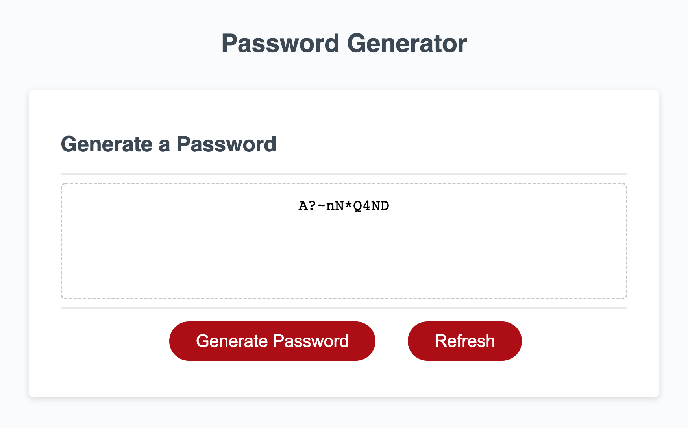

# Password Generator

### Password generator generates a random password as per user requirements.

Try out the password generator [here](https://anuvytla.github.io/password-generator/).

User inputs for the password generator:
- Length of the password: Integer 8 - 128 
- Include special chars: Boolean
- Include Uppercase letters : Boolean
- Include Lowercases letters : Boolean
- Include Numbers : Boolean

